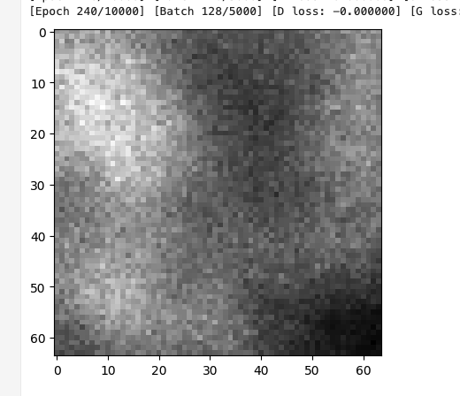
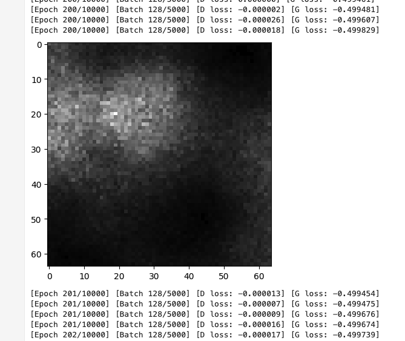
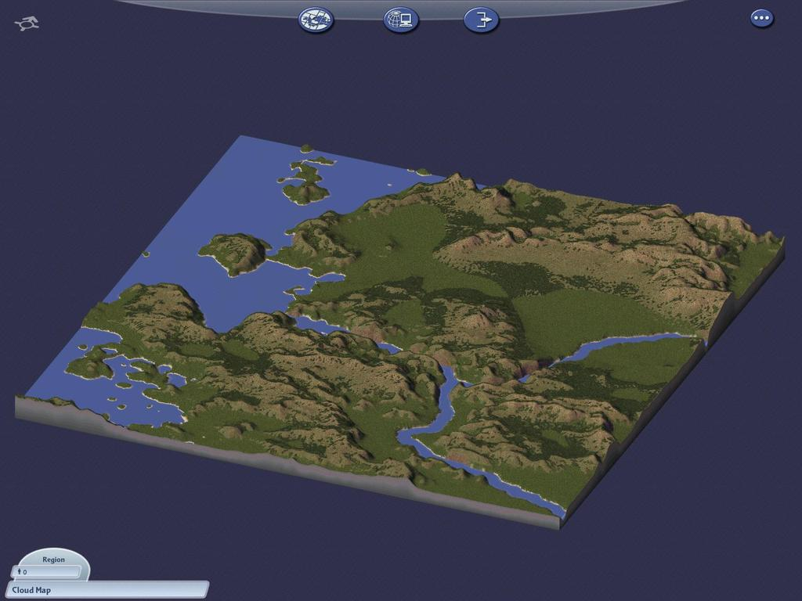
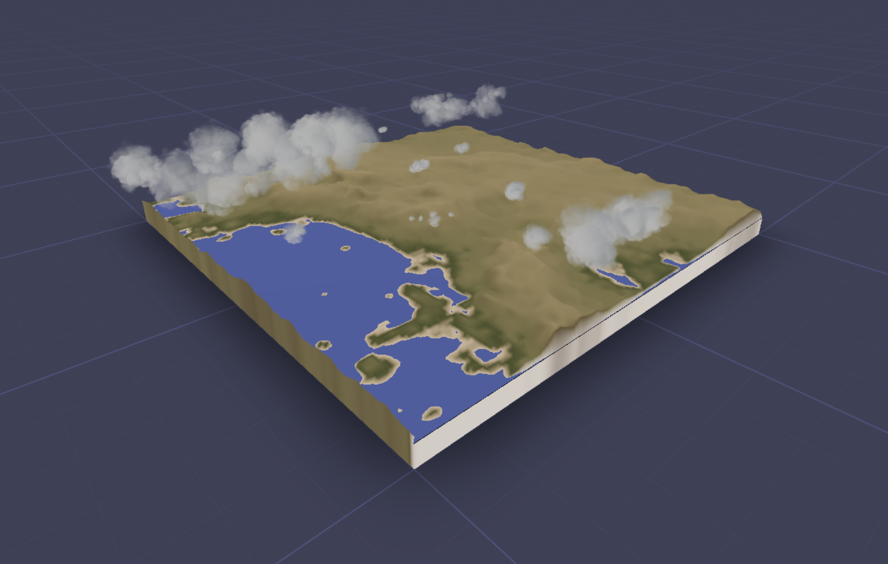
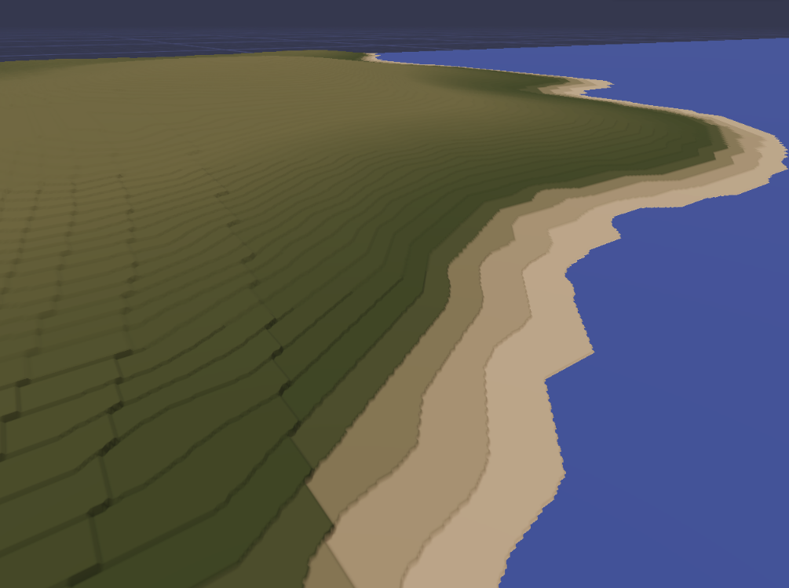

# W6D1

RC Week 6 Day 1

## Last week

Last Monday I was discussing how I wanted to Implement a GAN and render it. I spent Monday and Tuesday learning about GAN and implementing a WGAN following chatGPT and a couple blogposts

The result was decidedly mixed.

So in the middle of the week I decided to take a break and work on the rendering/app side of the project. I was inspired to take a look at old SimCity editions, because I remember being inspired by the terrain when I was younger. I found that SimCity 4 has a really great aesthetic that I tried to simply rip-off, and the process of trying to replicate that was very fun and productive. I recommend working this way, because it gets rid of the Blank Page Problem.

Simcity 4:

Video of rendered terrain heightmap in app (using real world data):
https://twitter.com/KennyPirman/status/1730364368489943395

During the process of replicating this I noticed that HelloWorlds library lacks a way to pull terrain skirt edges to a fixed depth, so I went ahead and added that property 'skirtDepth'. However there's a problem in my CI pipeline on github actions for deploying to npm, but thats a problem to fix for later.

Later in the week, @**Charlie Sweeting (he) (W1'23)** helped me implement a DCGAN, which is uses convolutional neural nets, to extract the shapes region-to-region across an image. The results look a lot less perlin-y, and a small percentage of the time the generator creates truly remarkable results with realistic regional structures. However, most of the time the generator fails to create anything than repetitive grid-like noise. I think this might be a type of Mode Collapse problem:

https://twitter.com/KennyPirman/status/1731441206138220909

I integrated the python model with node by spawning python as a child process. This is not a great solution, because the cold start of a python process is slow and heavy (maybe 3 seconds per response). I was not able to extract my model into a way that I can read in the browser or in node directly via tensor.js or other means, like via onnex, specially as a way to reduce the dependency on the large memory footprint of pytorch in production, as mentioned by @**Reuben Son (he) (W1'23)** . I hope I can solve this problem because I prefer to move all the functionality entirely to the client.

Here's the latest with a low-res model e2e with python:

I've also encountered a precision problem. The images I use are 8bit, and only have 255 values of precision for the elevation, which leads to a terracing or voxelized looking landscape. I think one way to go forward is to embrace this aesthetic as a constraint with artistic merit, but I would like to know how to resolve it. I tried to 'smooth' the values in the image by using the HTML canvas API to use gaussian-blurring, but the output after interacting with the HTML canvas API seems always to be 8bit anyways, which just leads to the same results. I think I could use 16bit values as input and output to the model, and make sure not to do any processing on the client, or do some non-canvas based (ie: difficult, annoying) upsampling/manipulation on the client. I'm not sure...

Terracing from lack of precision:
https://twitter.com/KennyPirman/status/1730379073640104050

## Friday/Weekend

I played a DnD oneshot DM'd by @**Nick Sanford (he) (S2'18)** . Did the first couple of days of advent of code with Nick using GO (was my first introduction to the language, found it very interesting. Something like the Soyuz of programming languages). I listened to @**Reuben Son (he) (W1'23)** and @**Julien Quint (W1'23)** talk about Musique Concrète (https://en.wikipedia.org/wiki/Musique_concr%C3%A8te) and talk about the medium of magnetic tape and how it influenced the musical pioneers' work.

## Today

I'll try to combine what I know about the DCGAN and WGAN and other techniques to improve mode collapse(like flipping images and adding noise). I'll continue to work on the terrain renderer. In particular, I really would like to somehow render the terrain sides with the inner view of the planet crust, which I find really charming, and requires some fancy shader tricks.

Let me know if anyone has advice about improving the model, running the model in the browser, or would like to pair somewhere :)

---

- Had Chat with game industry discord people about heightmap elevation precision
  Problems!!!

- [x] Terrain terrace problem
  - [ ] It looks pretty good!, solved with some poking of params, bilinear interpolation, and domain warping
- [x] Sometimes the sides get a wrapping problem
  - [ ] I still don't get it but it seems to be related by the -scale dimension which needs a + or - 1 (anyways its an off-by-one problem)
- ML output ugly
- Untextured
- Sides/Skirts Ugly
- No beautiful trees
- Ugly Water
- Camera not really nice :/
