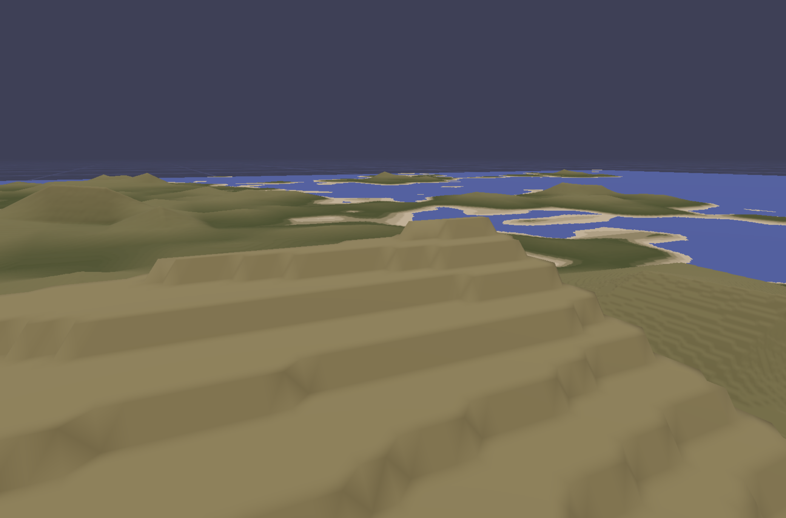
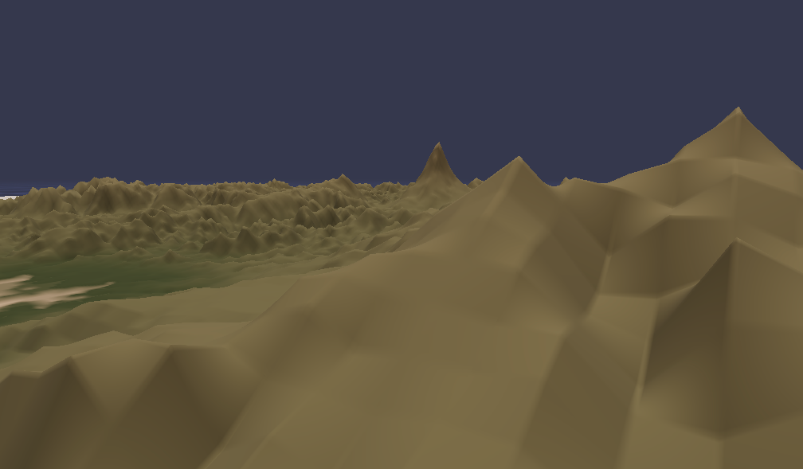

# W6D2

RC Week 6 Day 1

## Yesterday

Was mainly a heads-down coding day (after taking my laundry to the laundromat). I was able to solve one of the long-standing issues in my project TerrainSynth (Name pending). I was able to upsample the apparently resolution of the terrain as rendered in the app, even with a tiny 64x64 image, as well as resolve the 'terracing' issue.

### Terracing

Terracing was caused by me naively upsampling the small images to match the size of the terrain, so a 64x64 image would be blown up to 10,000 x 10,000. Not only was this really bad performance-wise (each web worker needs their own copy of the terrain data! there are like 12 web workers!!!), but it shot me in the foot because I wasn't able to derive gradients from essentially a bunch of flat regions where a single pixel of data would occupy hundreds.

I was able to fix it by sampling the original small image and for each vertex, use bilinear interpolation to find the gradients between the 4 closets points. This caused the map to look sort of triangly, but eliminated the Y-axis 'stepping' from lack of elevation information

### Fixing Low-quality Traingle-y Terrain

I played around with ways to add noise to the bilinear interpolation function to offset the values. My hope was that this would make things less sharp and more organic. I was able to get something looking pretty nice by using Domain Warping, offsetting the input X and Y input coordinates to the bilinear interpolation function (asking the question, where am I on the map?) by an offset of sampled noise. This results in a pretty convincing noisy overlay that seems to mask the underlying grid of the low-res heightmap image.

## Today

I plan to: - attend shader-learners, ML startup panel - work on niceties - work on improving the ML model

---

Interesting talk about Terrain stuff : https://docs.google.com/document/d/1B5ME4MryP8awPNSPcSWU8d4gI0xsK6fhAg_hinyfDK4/edit#heading=h.tbwm9b2syf88

Farcry 5 -> https://www.gdcvault.com/play/1025480/Terrain-Rendering-in-Far-Cry

square rotation -> https://glsl.app#~t43x4jnnsjh8bsq8saszokzw
matrix transforms -> [https://www.3blue1brown.com/lessons/3d-transformations](https://www.3blue1brown.com/lessons/3d-transformations "https://www.3blue1brown.com/lessons/3d-transformations")
