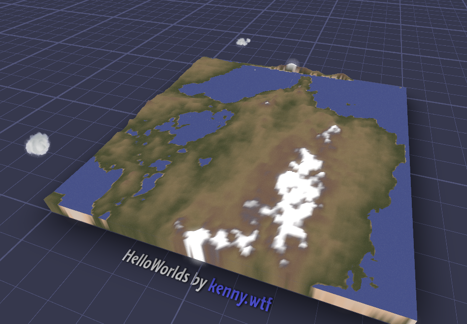
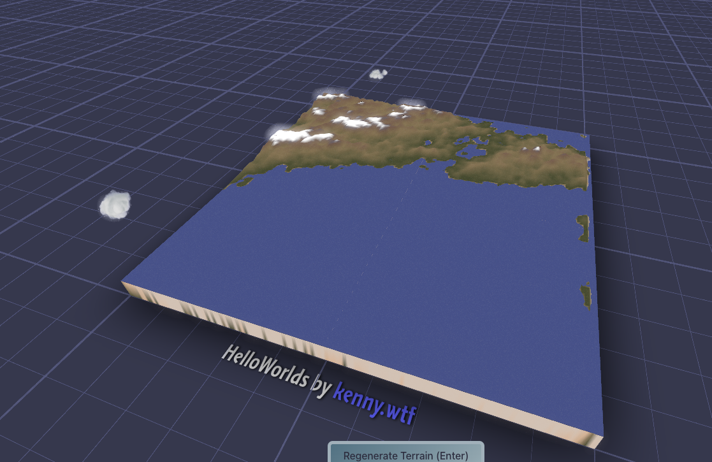
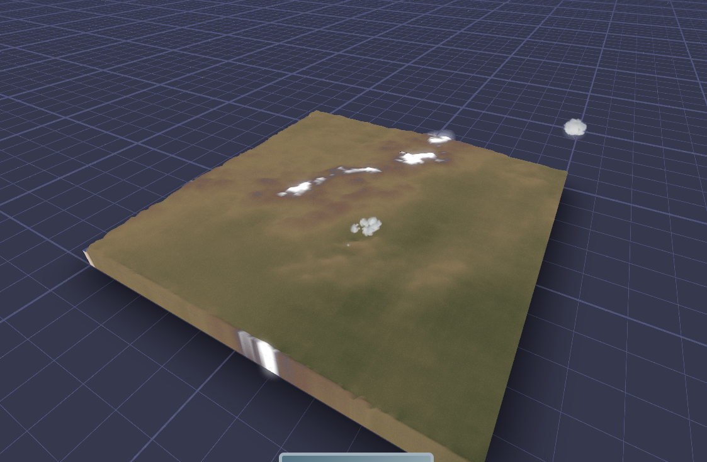
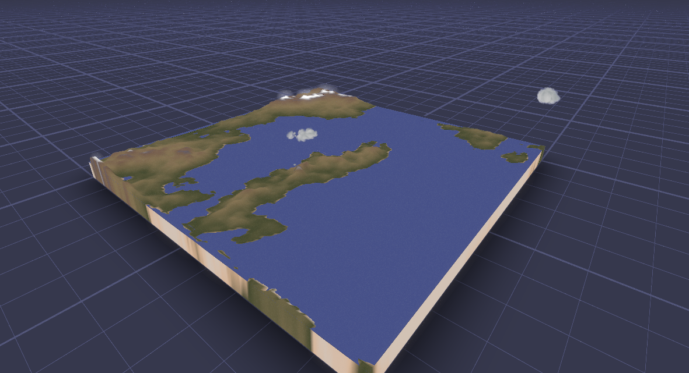
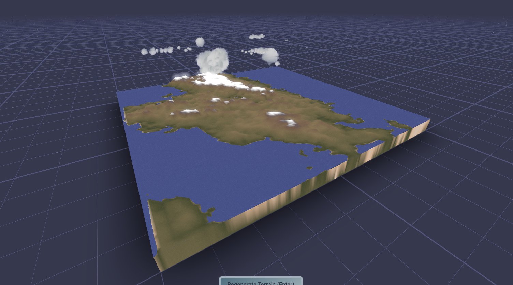
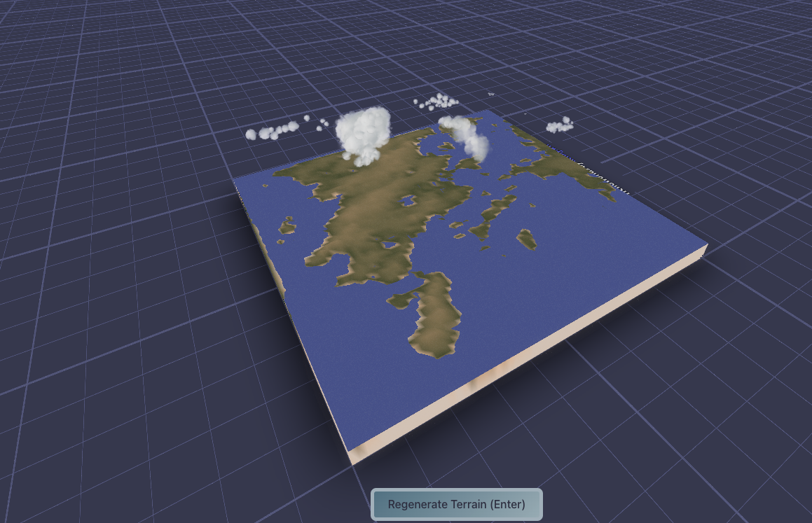
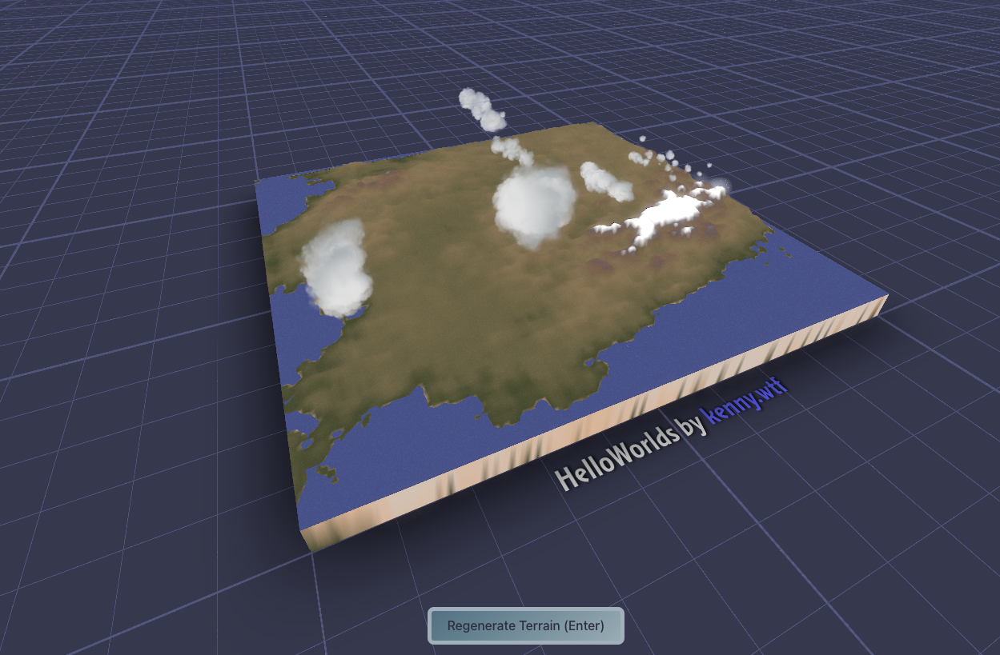
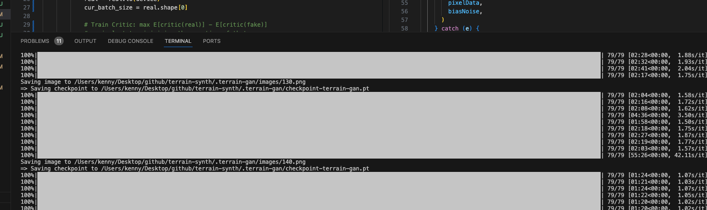

# W6+1D1

## Last Week + TerrainSynth

### Eat dessert first (pretty pictures)

Here's the current state of affairs for TerrainSynth.
It's now live: https://terrain-synth.kenny.wtf, please visit.
It's also now on github, so please star! https://github.com/kenjinp/terrain-synth

Currently the model is doing a great job of creating believable landscapes at the scales of ~500km (matching the training data)
It's especially good at placing mountain chains that follow coastlines and the spines of island chains. There's still edge artifacts, and I would like it to pick up more detail inside mountain chains (valleys and things), but I think the resolution is too low for that for now.

I've also got the entire model to run in the browser, via the js library by https://onnxruntime.ai/

Oh, I've also added white to the top of the color-spline so that mountains stand out a bit more, thanks @tristan for the recommendation! A huge part of this is color and human perception, I think having the mountains white like this makes the brain realize the scale is huge, and looks more like a satellite picture.

### Productionizing Python

For the first half of last week I worked on breaking apart the jupyter notebook into a proper python module, with a goal of making the process easier to share and improve, and because jupyter drives me crazy. I learned how to import python modules from other files and the normal stuff you have to do while using that, and how to save and restart pytorch models during training, so I don't loose progress.

I've also learned about a bunch of cool new python toys such as https://pypi.org/project/tqdm/ for visualizing that progress, and [tensorboard](https://pytorch.org/tutorials/recipes/recipes/tensorboard_with_pytorch.html) to track loss rates via a nice web console. I feel like a real ML engineer now!

### How to use the model "inferencing" in the web-app?

Unfortunately pytorch doesn't have a js runtime, so I've had to try to build it with onnx - a neural network interchange file format. After some heartache I was able to get the model to build. the generator itself is 14MB in the onnx file, which is a lot to load on mobile, but the inferencing takes just ~200 ms. That's fantastic, because it means I don't have to pay for compute by hosting a generation service! I also learned that the onnx model is smart enough to run the inference on a batch size of 1 (or more). I assumed the batch size was baked in, so I crashed my mobile device's browser many times attempting to run the inference on 64 images at once :D

### Deployment to the web via Pulumi

I love using [pulumi](https://www.pulumi.com/) as infrastructure-as-code stuff to deploy to the web, it gives all the access to AWS primitives in typescript. I created a folder called 'infra' with my typescript code and some config files, so that the webapp gets bundled into static files, shipped to s3 with a configurable domain name, and replicated on a cloudfront CDN. Then the domain name is shipped with some https certificates. Check out the code! https://github.com/kenjinp/terrain-synth/tree/main/infra/pulumi

I'm still wondering if I should create a generation service via lambda, but the client can handle the model sizes so far.

### Multithreading Improvements

After sharing on [twitter](https://twitter.com/KennyPirman/status/1733230871358918721) I got some great feedback (everyone likes the clouds.... which is the part I didn't write myself) about how sluggish things were when loading the model. I decided to shove all the model stuff in another thread, with 'load' and 'generate' methods exposed. The client can then load the big model and run it without lagging the UI (although, there's some jank when the image data is passed from webworker to main thread then to the terrain quadtree generator)

I also found that my mobile device is not happy with the webgl onnx runtime, so I use a fallback to a wasm runtime if that fails. It now runs happily in my phone without crashing the webpage!

### WGAN-GP

My model was still pretty weak and unimpressive so far. So I gobbled a bunch of academic papers and stalked a few masters students on reddit to see how they've done things. I should have probably started with that, but now I have the experience to actually make sense of the stuff. I still don't really understand how different architectures impact the final results, in so far I'd be able to architect my own for a specific use case, But now I think I know how to implement the next step of the process, which is to do image-to-image generation using something like perhaps a U-NET / GAN combo.

During my survey phase I found such a fantastic resource: https://github.com/aladdinpersson/Machine-Learning-Collection, which is a youtube series and github repo implementing many many many differnent types of generator. I pretty much arbitrarily picked the WGAN-GP and copied it's implementation, because it was the most familiar to me.

I cranked out this model last night. The results are immediately much better than the home-spun WDCGAN I implemented myself. I also was able to parameterize the python code much better, so it's now driven by a .env config file, which made testing hyperparams easier, and I was able to bump up the output size to 128x128 instead of 64x64 (I'm still not getting convolutions and how they stack together to increase the image size, but I was able to poke around at values to get the output I want, I'll need to look at this more closely)

## This week

This week the theme will be trying to turn my terrainSynth from a Toy into a Tool, by allowing the user to edit features and export the result as maybe an STL or a heightmap. Once it's useful in that way, I can publish a version to itch.io.

---- TODAY ----

- How to remove edge artifacts?!
- How to increase spikiness near the tops of mountains? (noise post processing!)

---- Russ advice

- assert float vs int and throw
- assert ranges
- heightmapX
- canvasY
- xx

--- TOMORROW ---

checkout video for wgan-gp
checkout video for pgan
