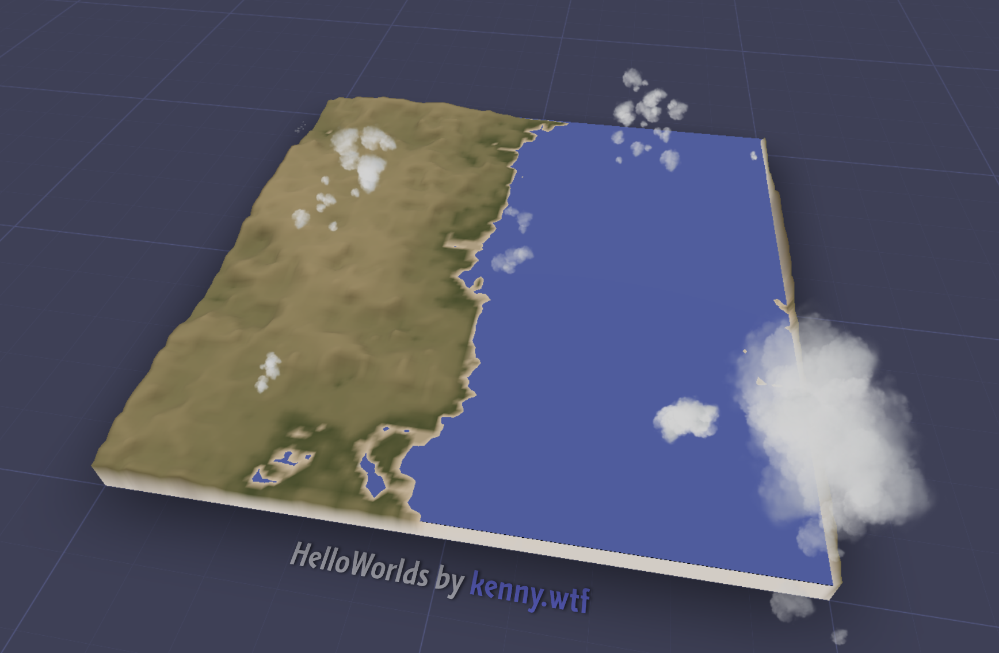

# Holiday Break + TerrainSynth

RC Week 7 Day 3

links: [https://terrain-synth.kenny.wtf](https://terrain-synth.kenny.wtf/ "https://terrain-synth.kenny.wtf/").  
github: [https://github.com/kenjinp/terrain-synth](https://github.com/kenjinp/terrain-synth "https://github.com/kenjinp/terrain-synth")

Here's the current state of affairs. It's gotten some attention on the threejs twitter, garnering me something like 200 new followers and 53 new github stars since my last checkin ;)

That's the current live version, and for local one (same seed), you can see I've been playing with the atmospheric model, which has a subtly different (and physically accurate) hue

## Terrain Synth Improvements

During the break here I've been focusing mainly on graphics related stuff. You can see the biggest differences has been the appearence of shadows and some glowy 'skybox' to the scene. I've also poked around with the vertex coloring height-based lerping.

### Shadow Maps

I managed to get shadows working, mostly by changing the default settings of the threejs renderer to create larger shadowmaps that spans the 10km of the scene.

however, the clouds were not casting normal shadows. That's because they're bilboard sprites that always face you, so much of the time they're edge-on to the sun, creating slivers of shadows. I solved this problem by creating an invisible clone of the cloud billboard, but angle it always towards the sun, so that it's full face is exposed.

(me triyng to figure out why the silly sphere has shadows, but not my imposter cloud billboards)

This worked out pretty well, and by tuning the shadow bias and such, I was able to get this scene

I could not figure out why my shadows were square, until a discord user made a PR to my github project, fixing the problem for me! (I needed to pass the alphaMap as well as the normal texture map to the cloud instance). That's why you build in public!!!

### Ocean Maps

I really wanted to achieve the effect of an ocean with depth. That way, when you glance at the sides of the terrain, you should be able to see a slice into the ocean, like in this picture from SimCity4.

The problem was, that the elevation data I am using for the models, and therefore the heightmap, treats sea-level as 0. There is no negative value data. Therefore, I was simply rendering the terrain as blue, wherever the altitude was 0

So, how could I create some oceanic sea-floor (bathymetric) data, where none exists? I came up with the idea of creating a complimentary heightmap, called the oceanmap, along with the normal heightmap. Two heightmaps is double the data, but also double the precision in altitude, and doubles the 'headroom' from sea-floor to mountaintop.

To create the ocean map, I iterate over each pixel in the original heightmap, and if the pixel is at sealevel (0), then I calculate the distance to the nearest non-zero pixel. This is kind of expensive and brute-force-y, but the output is a lovely inverse terrain that gently slopes away from all the shores, including islands and inland seas.

In the heightGenerator function, I first read the normal heightmap, then if the value is 0, I read from the ocean heightmap instead, get it's interpolated value, and add a layer of "Billowing" noise to obscure the grid, in the same way I did to the heightmap. Here I found "Billowing" type noise to be aesthetically... uhhh.. oceany.

I then created a color lerping palette to apply to the ocean bottom, lerping between colors at elevation intervals based on colors I found in an image search for 'ocean pixel art'

Here you can clearly see the sloping radial patterns that form as a distance function tho the shorelines

The ocean colors really give it a pacific vibe, and a lot of character!

### Synthesizing Atmosphere

The next thing I new I wanted was to somehow render atmosphere on my scene. Atmosphere, or more typically for video games, simple fog, is really important, because it adds color to your scene as a function of depth. This makes things in the forefront stand out and gives your objects a sense of scale. I knew I wanted to somehow render a slice of atmoshpere, extending up from the terrain tile to 'space', as if someone took a big cutout from the earth + atmosphere and served it on a table.

In order to do this, I used a technique called raymarching. Basically, you make a shader for the entire screen (a "full quad shader", or in my case, a "postprocessing shader"). Then, for each pixel on the screen, you shoot a beam of math forward, and when it intersects with something, return a color. This is really difficult to do, mainly because it's difficult to work out in my head what is the origin points of that beam, and how do I convert the pixel coordinate to world space, etc etc. I eventually got something working, using a simple Signed Distance Field calculation from IQ's website (https://iquilezles.org/articles/boxfunctions/)

This was pretty cool (and took a LONG time to get it to show anything), but something is still wrong. Basically, there's no depth. It shows a blue color if the cube exists anywhere in the z axis from the camera, but it doesnt 'accumulate' blue over distance.

After some struggling with for loops, I basically came up with this algo. I shoot a beam from the pixel and see if I am inside the box. If I'm inside, I detect the distance to either the box's exit or a collision with the scene (by reading the depth buffer....that was a whole other can of worms).
Once I have that distance defined, I can chop it up into steps, and iterate over a for loop. at each interval, I add to the scene color some value of sky color.

This is starting to look better. You can tell things accumulate over distance, because at the corners there's not much atmosphere to go through.

I then created a height-based falloff, so that the amount of sky added over each "step" exponentially drops off as you get further away from Y = 0.

Now that looks better! You can tell people standing on the mountains will have a lot less to breath than at sea level.

It also looks very convincing while standing inside the cube, like from standing from the terrain looking out.

https://twitter.com/KennyPirman/status/1737213853375582354/video/1

Doesn't that look like sky? Can't you FEEL the DEPTH! (you can also see I was playing around with terrain seam normals, but thats not something I want to relive...)

### Volumetric Atmospheric Shadows

Having sky is great and all, but I got to thinking. I have clouds, and I have a shadowmap. Surely there's a way I can read the shadowmap inside atmosphere shader and have some interactivity with that?

Here's an image of what I'm talking about from the UnrealEngine docs. You can see that the atmosphere is shaded with rays of light being cast down from the light source, creating these stunning god rays.

Basically, at each step of my atmosphere loop, I had to read the shadowmap, which is an image that shows distance, like a depth map, but from the perspective of a light source. If you have a thingy in the scene and that thingy is further away from the lightsource than the distance rendered on the shadowmap, then you're being occluded by something, the light can't 'see' you, and your thingy is in shadow. The problem is, how exactly do you extract that information from the shadow map from an arbitrary point on the screen?

Well not like this:

it turns out the depth is packed in a crazy RGB format to gain precision. Here's a video of that looks like rendered to a surface, and why I could get the depth right: https://twitter.com/KennyPirman/status/1737269178279526623/video/1

but eventually I got plausible values...

Here's the first good result. I was stunnned!!!! (even though you can see that the shadowmap actually doesnt extend far enough on the left of the tile, cutting off the atmo in a big triangle slice)

And some beauty shots of cascading shadows extending from mountain peaks

And some youtube video of the effect in action: https://www.youtube.com/watch?v=FDhrBpWrzUc

I got god rays like in Unreal! wooo!

### Seeded Generator

Another thing I wanted to add is to seed the model's generator. This is possible because the model is deterministic, but I just needed to figure out how to engineer it. I rewrote the react app so that the terrain component takes a react prop called seed. If that prop changes, the entire terrain component will be re-rendered, passing that seed to the webworker that hosts the ML model and create its latent space input array using a seeded random function. This also makes things easier in react-land, because handling the 'regenerate' button just means creating a new seed.

I love seeding things like this and making the params available in the URL. Ideally most state should exist in the URL. This allows you to share interesting terrain to friends, bookmark them, whatever. You can even see what your name would be as a seed. Here's https://terrain-synth.kenny.wtf/?seed=kenny, which looks like the edge of some alpine lake.

## Random things

During the break, I spent a lot of time at the center playing Baba Is You with @Jesse and @Rea. It's really fun and feels like mob-programming.

@Jesse also introduced me to the world of Long-form Let's Plays from Paradox Interactive games. I'm currently reading through an excellent let's play of Tibet.

I also talked to a discord-buddy, who is in the process of creating an edwardian hotel horror game for STEAM using web technologies. He's using Linear for project management. If any #Gamedev people think it would be interesting, I've asked him to talk about how he organizes his small studio.

## Next Steps

I'm struggling to find a 'doneness' state for my project. There's a lot of things I still would like to do. I think it's a great project because it does a good job of evoking possibility, even though that 'content' doesnt exist, and I didn't have to perform the labor for that. A simple tweet like this explains what I mean: https://twitter.com/KennyPirman/status/1737947303762362418/photo/1.

Anyways, I'm not sure where my focus will be this week~
