import v1 from "../../public/assets/c13857a2e9c2ac5ce64f0ddc3d89a9ca.mp4";
import LinkButton from "../../components/LinkButton.astro";

# Modeling Verisimilitudinous Worlds: Part 1 - Tectonic Plates

(1 week left in RC!)

This series is about my project <LinkButton href="/projects/world-synth">World-Synth</LinkButton> (I couldn't think up a better name and just had to keep moving, please help me find a better one!). A tool/toy to generate fully modeled earth-like & earth-sized worlds using browser technologies.

<video controls client:visible>
  <source src={v1} type="video/mp4" />
</video>

[Here's the latest (very WIP) version](https://world-synth.kenny.wtf/), which you can enjoy online:
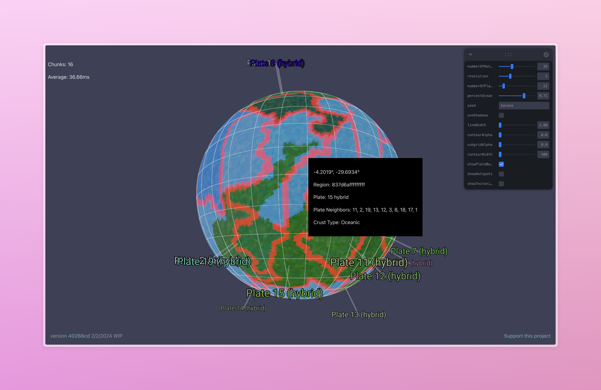

## What's going on here?

### The inspiraiton

This project has been inspired by this [beautiful tectonics-based world generator](https://web.archive.org/web/20180329122135/http://experilous.com/1/project/planet-generator/2015-04-07/version-2) and it's [accompanying blog post](https://web.archive.org/web/20180307135703/https://experilous.com/1/blog/post/procedural-planet-generation), and I've been wanting to build it (and have a couple of discarded attempts) ever since I came across it while looking for a good world map generator for a dnd campaign I was running in 2018. It's largely the reason I began learning webgl and built <LinkButton href="/projects/hello-worlds">Hello Worlds</LinkButton>. That blog post is a master class in procedural modeling, and includes techniques from tectonic stress simulation to climate modeling for biome placement. It effectively demystified procgen in general for me.

Since then, [Frozen Fractal](https://mastodon.gamedev.place/@thomastc) has also introduced a beautiful blog series going into a similar technique to creating Earth-like worlds with an incredible amount of depth in the climate modeling aspect, and is ongoing.

Note: I'll continue to showcase similar projects as I find them, so throw them to me, because I find these works incredibly motivating.

#### Experilous' Planet Generator

(You can see the gorgeous island arcs and realistic continent shapes that this generator produces, swoon!!!!!!!)
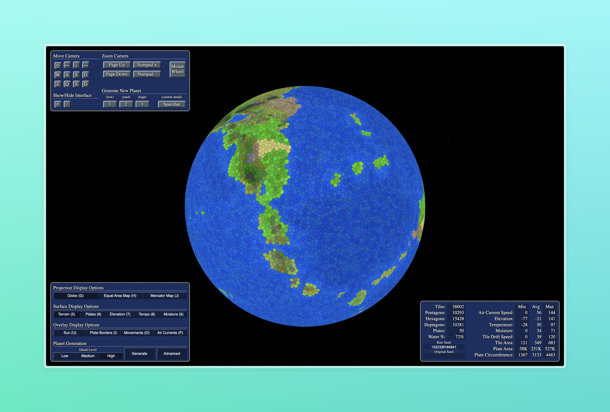

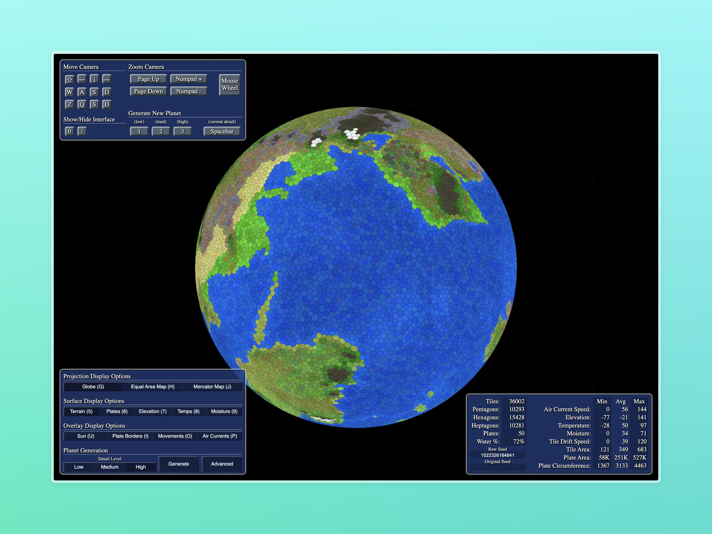

### Project World-Synth

What that project doesn't have, however, is space-to-ground rendering of the terrain. It only represents terrain elevation as a color map and the world is represented as a hex grid. What I'd like to do, is merge this with a Quad-tree driven LOD system to build a world which will have these gorgeous, believable regional features as a terrain generation mechanism to drive the level-of-detail generation from the continent scale to the player height scale.

Since we have a whole planet to cover, this project will provide us a lot of examples and experiments to hack on. Perhaps along the way, we'll be able to generalize it into a set of craft techniques that might be catalogued, in order for others to learn from it as well.

It will be powered by <LinkButton href="/projects/hello-worlds">Hello Worlds</LinkButton> as the terrain rendering engine, in order to improve that library in tandem, which will handle the spherical quadtree / mesh generation aspect so we can more-or-less focus on the shape of the terrain.

Performance-wise, my goal is to be able to generate large-scale model data in about 10 seconds and then have the terrain chunks stream in in less than 100ms each, so near real-time. The current live version takes about 13 seconds on my hardware and around 120ms, so still a lot to improve even at this early stage.

## The Game Plan

How are we going to let a user build a whole earth in less than 10 seconds, and then fly around it in realtime?

### "Offline/Online" generation

If we were able to generate all the information we want to generate the whole surface of the earth ahead of time, that would be great. Every chunk would simple read from some heigh texture in O(1) lookup time - blasing fast! Unfortunately that would mean that each planet would have to generate many hundreds or thousands of gigabytes of data, simply too much for us to generate in a reasonable amount of time and expensive to store.

Instead, we could use layers of noise and noise masks to render the whole planet, which would be very fast. Here's an example of what that looks like while I was trying this out (ignore the plate indicators, they weren't used to render the planet this time)

Simple noise planet, pretty nice!
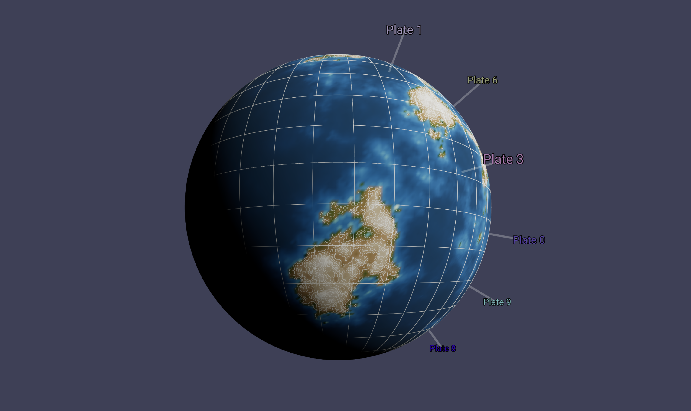

This looks pretty good! (Especially with an elevation color ramp borrowed from NOAA), but noise does not give us relationships between regional features. For example, we could know whats above water or under it, but we would not be able to create discrete formations where you would expect plates to collide or pull apart, because we need to qualify the relationship between two points. It would be difficult to generate rivers and mountain chains with this method. There's probably a clever way to achieve this, using multiple derivatives of noise masks or some such thing, but I'm not sure about that.

Instead, we'll create some data structure to hold regional features, like continental details, plate collisions, or whatever that will drive the emergent large-scale phenomena we want to replicate. we'll generate that all upfront, which will take some seconds, and then after in real-time, during terrain chunk generation we'll query our current position against that dataset to see what kind of terrain we want to make. This effectively makes each terrain feature a distance function:

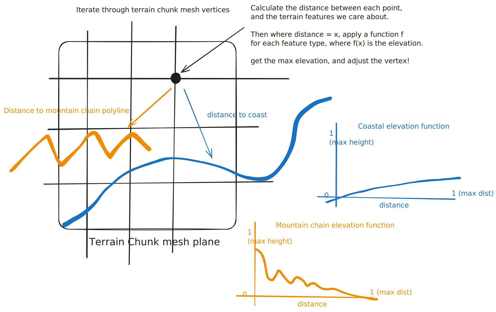

There's a rub though. Iterating through each feature on the planet by each vertex is going to be super expensive, so we should create some system to query against only the nearby features, perhaps using some kind of spatial grid system, such as [detailed in my previous post] and a bucket of other techniques I haven't thought of yet.

Also, this is probably a very naïve way to do things. I'm not even sure it's practical. I'm sure seasoned game devs are yelling at me, but let's try anyways!

## Grand Strategy - Plate Tectonics

we'll do a plate simulation driven elevation model, so we'll need a way to create tectonic plates, and crash them into each other. we'll calculate the direction of movement at the plate boundaries, use that to classify the plate boundary collision type, be it convergent, divergent, or transform, and use that to place mountains, island chains, volcanos, etc.

### Making tectonic plates

#### Subdividing planet into Regions.

First we'll take the planet and subdivide it into zones I call `Regions`. Here, I'm using the [h3-js](https://h3geo.org/docs/) library's hex tiles as my Regions, but in the past I've used voronoi tiles. The important bit is that they're aware of their neighbors, and can be queried from a LatLong or Vector3 position. I'm using javascript classes, and the shape looks a like this:

```typescript
export interface IRegion {
  id: string;

  polygon: SphericalPolygon;

  plate?: IPlate;

  type?: PlateType;

  getArea: () => number;

  assignPlate: (plate: IPlate) => void;

  getCenterCoordinates: (latLong?: LatLong) => LatLong;

  getNeighbors: () => IRegion[];

  getSharedVertices(region: IRegion): LatLong[];

  getCenterVector3: (radius: number) => Vector3;
}
```

Planet subdivided by regions, there are ~41k regions on this sphere.
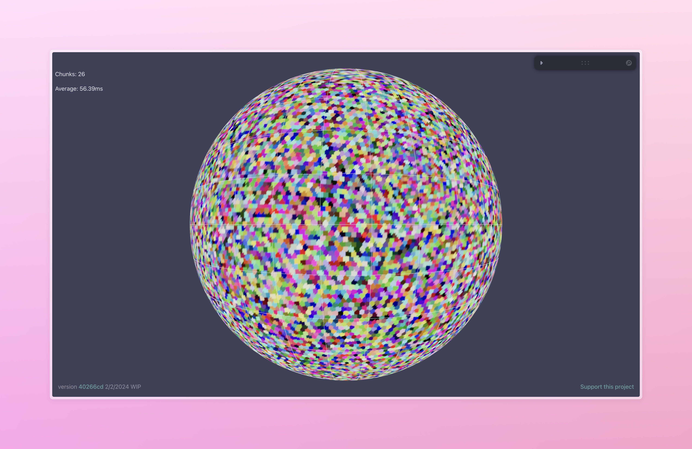

An earlier attempt at using voronoi
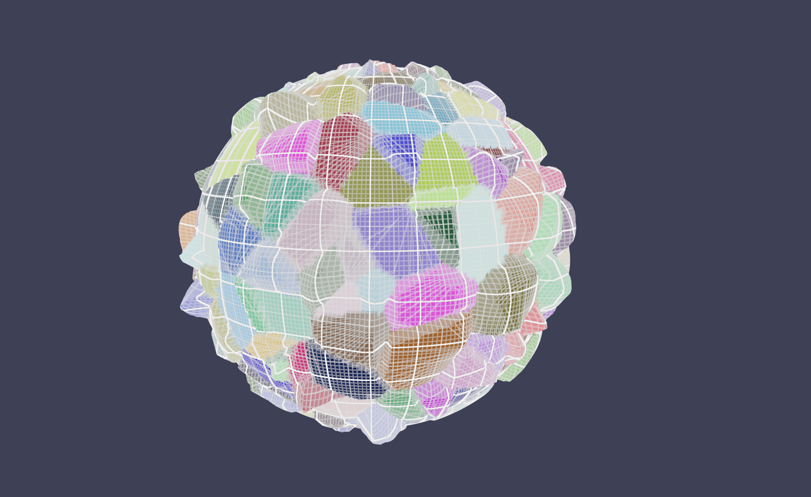

#### A note about the grid

Even though we're using discrete regions like this as a way to conveniently query and model our planet's features, I'm hoping we won't end up with a clearly hexagonal grid showing up in the final result, and it will end up looking (more-or-less) naturalistic. We'll use some techniques in the end, like jittering or layering noise, to hide the fact that we're using a grid from the user.

#### Creating and Growing Plates

Next we'll choose a random Region for each Plate we want to have, the number of which can be assigned by the user. That Region will be the origin for a Plate. We'll assign it's type to `Continental`. Next, we'll use a floodfill BFS algorithm to grow each plate by a neighbor Region. During each step, the neighboring regions are assigned a cost. Cost functions are a great way to be able to tune your algorithm, and it's the first time I've used such a technique, and absolutely love it. The regions are sorted by their cost, and the 'cheapest' Region is added to the plate, and assigned as `Continental`. This continues until the planet's surface is covered in the desired land percentage (.71 ocean for Earth), or the Plate's Region candidate start to hit a `MaxCost` limit, and there's nowhere to grow, or there's no more Regions left to assign.

##### Cost Functions

My first attempts to grow the plates without any sort of cost function led to long, spindly plates, far reaching plates that were not very realistic.

Plates growing snakily.
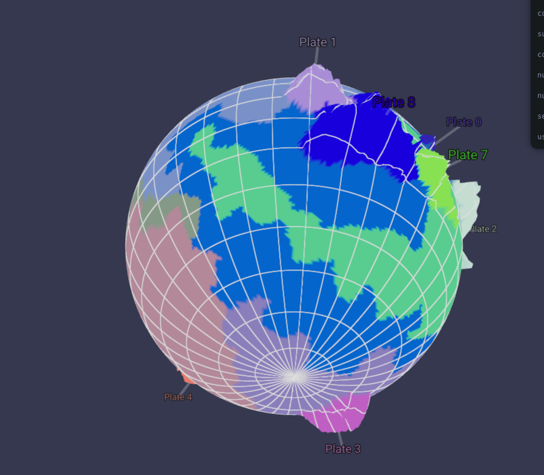

I needed a way to tune the direction of the plate's growth, so I added two cost functions that score the plate by a normalized `distanceScore` and a `biasDirectionScore`. The first is simply the distance to the origin plate, so it will tend to grow in an expanding circle. The `biasDirectionScore` will favor tiles in a certain degrees of bearing from the plate origin. Both of these scores are attended by parameters, added together, and modulated by 3D noise.

I'm now in the game of normalizing absolutely everything. It makes things so much easier to reason about when they're 0 to 1. Here the max distance would be if the candidate region was on the other side of the planet, and the max bearing penalty would be if its 180 degrees away from the desired plate growth direction (ideally this should be measured from the closest plate neighbor region, so that plates would expand as big blocks in that direction instead of having these strange conical projections, but I was too lazy to do that)

```typescript
const distanceScore = calculateDistanceScore();

const biasDirectionScore = calculateBiasDirectionScore();

const cost =
  (distanceScore * params.distanceScoreBias +
    biasDirectionScore * params.bearingScoreBias) *
  (1 - noise) *
  plate.growthBias;
```

Our new cost function (with no noise modulation) creating some seashell continents
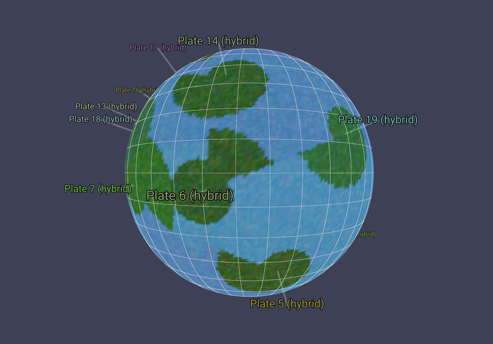

Some more naturalistic continents with noise added, on the same seed and settings as the image above.
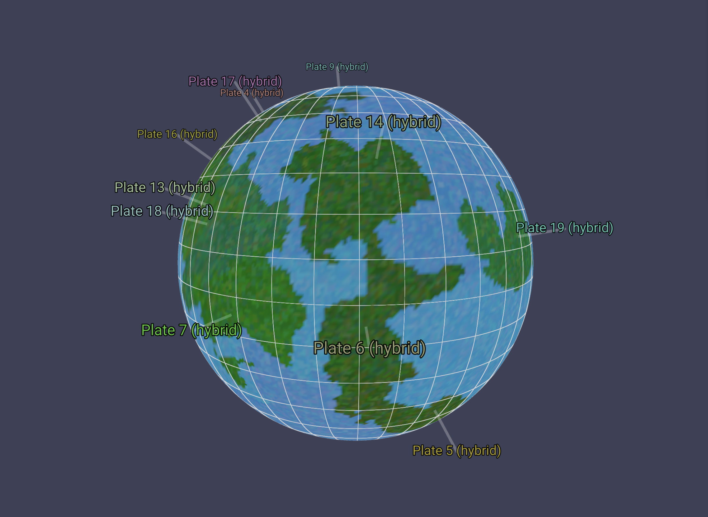

#### From Continental Crust to Ocean Crust

I've taken inspiration from Frozen Fractal's method of growing continental plates outward as the ocean component. This might not be obvious way to go about things, but plates are composed of, it seems, both continental and oceanic crust. The continental crust is simply less dense matter that has frozen out to the top of the crust, and sort of surfs along the much denser oceanic crust layer. You can see here that most plates have a continental component, then an oceanic component that usually expands out in a direction away from the continental crust.

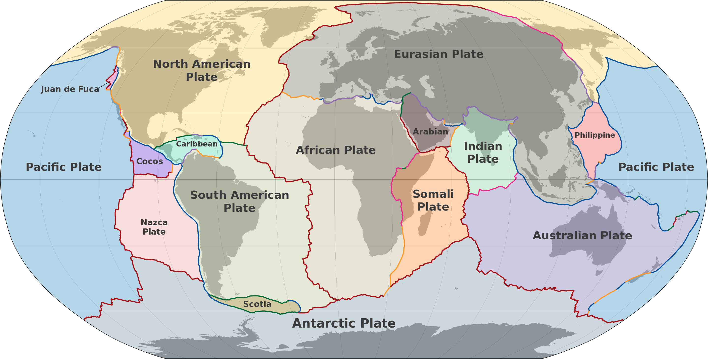 [from wikipedia](https://en.wikipedia.org/wiki/Plate_tectonics#)

We'll apply the same floodfill algorithm again, this time allowing the plates to expand further by modulating the cost function's penalty, and lowering a bit the noise settings. Each Region that's added to a plate now will be marked as oceanic crust. As we expand, we'll keep track of the regions that bump into another plate, and create a map of these boundary regions. This way, we can render our plate boundary regions a different color, and we'll use this later to create our tectonic collision zones.

Our plates now extend into the ocean on one coast of the continental plate we started with.
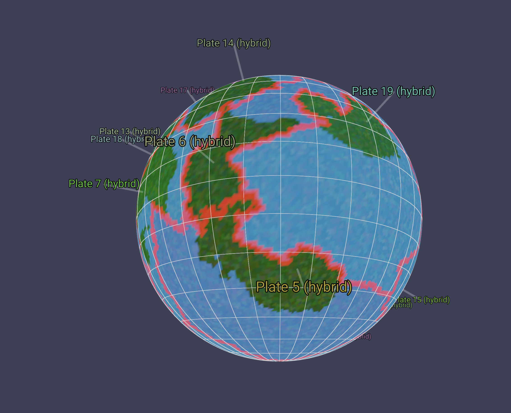

I'm pretty happy about the shapes of the continents so far. I feel like they're providing some interesting naturalistic shapes, and you can see where continental collisions could raise island chains and mountain ranges.

## Next Steps

Now we've defined our tectonic plates, we'll need to crash them together and figure out where mountains pop up! Continue following this series to see how that goes!

## Other notes

This week is the last week at Recurse Center! Ahhhh!!!!!!!!111
